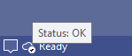

[marketplace]: https://marketplace.visualstudio.com/items?itemName=MadsKristensen.VsStatus
[vsixgallery]: http://vsixgallery.com/extension/VsStatus.0c47f4af-bd3b-42f5-877b-b43bdc80e17d/
[repo]: https://github.com/madskristensen/VsStatus

# VS Service Status

Download this extension from the [Visual Studio Marketplace][marketplace]
or get the [CI build][vsixgallery].

---

Shows the Visual Studio Service Status icon at the status bar, making it easy to see if a service you rely on is having issues.

Hovering the icon shows the status in a tooltip.

Clicking the icon will open the [Visual Studio Service Status page](https://status.visualstudio.microsoft.com/) in your default browser.

To manually refreshing the data, right-click the icon and hit *Refresh*.

## How can I help?

If you enjoy using the extension, please give it a ★★★★★ rating on the [Visual Studio Marketplace][marketplace].

Should you encounter bugs or if you have feature requests, head on over to the [GitHub repo][repo] to open an issue if one doesn't already exist.

Pull requests are also very welcome, since I can't always get around to fixing all bugs myself. This is a personal passion project, so my time is limited.

Another way to help out is to [sponsor me on GitHub](https://github.com/sponsors/madskristensen).
